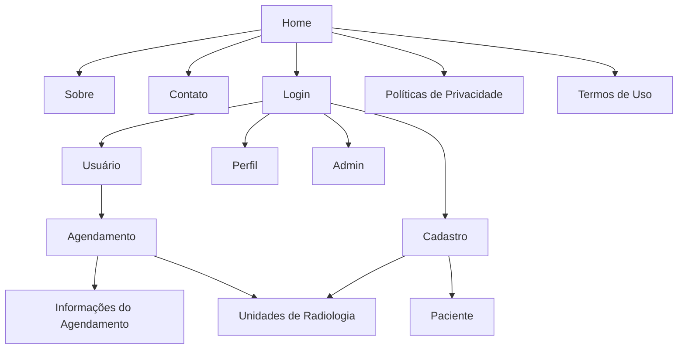

  <picture>
    <source media="(prefers-color-scheme: dark)" srcset="resources/assets/images/logos/logo-bora-rachao-white.png">
    <source media="(prefers-color-scheme: light)" srcset="resources/assets/images/logos/logo-bora-rachao-black.png">
    
  </picture>
  
  # Sistema de Agendamento de Radiologias Odontológicas
  ### Centro Paula Souza
  ### Faculdade de Tecnologia de Jahu 
  ### Curso de Tecnologia em Desenvolvimento de Software Multiplataforma
  ### Jaú, SP, BR
  ### Início: 2º Semestre / 2025
  # Documento da aplicação web

# Autores:
<h3 align="center">
   &nbsp;
  <a href="https://www.linkedin.com/in/joaosurita/">João Pedro Surita</a>;
  <a href="https://www.linkedin.com/in/brunoobrunelli/">Bruno Oller Brunelli</a>;
  <a href="https://www.linkedin.com/in/eduardo-petarnella-gabri-18986b353/">Eduardo Petarnella Gabri</a>.
</h3>

<h1>Sumário</h1>

  - [1. Resumo da aplicação web](#1-resumo-da-aplicação-web)
    - [1.1. Objetivos](#11-objetivos)
    - [1.2 Métodos da pesquisa](#12-métodos-da-pesquisa)
  - [2. Documento de requisitos](#2-documento-de-requisitos)
    - [2.1. Requisitos funcionais](#21-requisitos-funcionais)
    - [2.2. Requisitos não funcionais](#22-requisitos-não-funcionais)
  - [3. Regras de negócio](#3-regras-de-negócio)
    - [3.1. O que será elaborado?](#31-o-que-será-elaborado)
    - [3.2. Como será elaborado?](#32-como-será-elaborado)
    - [3.3. Para quem será elaborado?](#33-para-quem-será-elaborado)
    - [3.4. Quanto custará?](#34-quanto-custará)
  - [4. Estudo de viabilidade](#4-estudo-de-viabilidade)
  - [5. Design](#5-design)
  - [6. Protótipo](#6-protótipo)
  - [7. Aplicação](#7-aplicação)
  - [8. Considerações finais](#8-considerações-finais)
  - [Referências bibliográficas](#referências-bibliográficas)

# 1. Resumo da aplicação web
Trata-se de um sistema desenvolvido para otimizar o processo de atendimento em clínicas de radiologia odontológica, reduzindo as filas presenciais e o tempo de espera enfrentado pelos pacientes. O principal objetivo é simplificar e agilizar o agendamento de exames radiológicos, permitindo que os usuários realizem a marcação de forma remota, prática e eficiente.

Além de facilitar a rotina dos pacientes, o sistema contribui para uma melhor organização do fluxo de atendimento nas clínicas, evitando sobrecarga em determinados horários e possibilitando uma distribuição mais equilibrada das demandas. Dessa forma, promove-se não apenas comodidade para os usuários, mas também maior eficiência operacional para os profissionais e gestores da área da saúde odontológica.

## 1.2. Métodos da pesquisa
O desenvolvimento deste projeto conta com o apoio da infraestrutura da Fatec de Jahu. As atividades são realizadas tanto durante as aulas quanto em horários livres, utilizando os computadores dos laboratórios da instituição, assim como os dispositivos pessoais dos membros da equipe.

Para a criação da interface e da estrutura da aplicação, estão sendo empregadas as linguagens HTML, CSS e JavaScript, junto com o framework Bootstrap. O protótipo visual está sendo elaborado no Figma, que permite a colaboração entre os integrantes e facilita a definição do design das telas.

O back-end do sistema será implementado em PHP, com o banco de dados MySQL, utilizando o XAMPP como ambiente de desenvolvimento local. O código-fonte é editado no VS Code e gerenciado por meio do Git, garantindo controle das versões e organização durante todo o processo de desenvolvimento.

<h3 align="center">
   &nbsp;&nbsp;
   &nbsp;&nbsp;
   &nbsp;&nbsp;
   &nbsp;&nbsp;
   &nbsp;&nbsp;
   &nbsp;&nbsp;
   &nbsp;&nbsp;
  
   &nbsp;&nbsp;
</h3>

Todo o projeto está sendo desenvolvido nas instalações da Fatec de Jahu, que fornece a infraestrutura e o suporte necessários para a execução das atividades. As tarefas são realizadas ao longo do semestre do curso, integrando-se aos conteúdos das disciplinas, o que permite aplicar de forma prática os conhecimentos adquiridos em sala de aula.

[Voltar para o início](#inicio)

# 2. Documento de requisitos
Um documento de requisitos de sistema descreve o que o sistema deve fazer, suas funções, regras e limitações. Ele serve como guia para o desenvolvimento, ajudando a garantir que o sistema atenda às necessidades dos usuários e funcione corretamente.

## 2.1. Requisitos funcionais

### RF1 - Exibir informações sobre a equipe do PI
O sistema deve exibir informações sobre cada integrante da equipe do PI, tais como: nome, mini currículo, e-mail, celular.
### RF2 - Realizar login
O sistema deve permitir o login do usuário.
### RF3 - Cadastrar usuários
O sistema deve permitir o cadastro de pacientes com os seguintes atributos: nome, e-mail, senha, celular.
Além disso, deve permitir o cadastro da Unidade de Radiologia com os seguintes atributos: nome, endereço.
### RF4 - Mostrar Unidades de Radiologia
O sistema deve exibir todas as unidades de Radiologia disponíveis.
### RF5 - Exibir Serviços
O sistema deve exibir os serviços oferecidos pelas unidades de radiologia.
### RF6 - Agendamento de Exame
O sistema deve permitir que o usuário agende um exame selecionando a unidade de radiologia, o tipo de exame e o horário disponível.
O sistema deve mostrar a disponibilidade de horários em tempo real e permitir a escolha do horário que melhor se adapta ao usuário.
### RF7 - Cancelamento de Agendamento
O sistema deve permitir que o usuário cancele um agendamento previamente realizado, com uma notificação de confirmação de até um dia antes.
### RF8 - Lembretes de Agendamento
O sistema deve enviar notificações por e-mail ou SMS para lembrar os usuários sobre o exame com pelo menos 24 horas de antecedência.
### RF9 - Alteração de Agendamento
O sistema deve permitir que os usuários alterem um agendamento já feito, escolhendo um novo horário ou unidade de radiologia, se necessário.
### RF10 - Consulta de Histórico de Agendamento
O sistema deve permitir que os usuários visualizem o histórico de agendamentos passados e futuros.
### RF11 - Relatório de Agendamento
O sistema deve gerar relatórios sobre os agendamentos realizados, cancelados e futuros, para análise de desempenho e gestão dos serviços.
### RF12 - Interface de Administração
O sistema deve permitir que administradores (gerentes das unidades de radiologia) visualizem e gerenciem os agendamentos, ajustando horários e disponibilidades conforme necessário.

## 2.2. Requisitos não funcionais

### RNF1 - Desempenho
O sistema deve ser capaz de processar agendamentos rapidamente, proporcionando uma navegação fluida para o usuário.
### RNF2 - Usabilidade
A interface deve ser intuitiva, acessível e adaptável a diferentes tamanhos de telas, como computadores, tablets e celulares.
### RNF3 - Portabilidade
O sistema deve funcionar corretamente nos principais navegadores de internet e dispositivos móveis.
### RNF4 - Manutenção
O sistema deve ser de fácil manutenção, com documentação clara e organizada, permitindo futuras atualizações e correções.
### RNF5 - Suporte
Deve ser disponibilizado suporte técnico para solucionar eventuais problemas no funcionamento da aplicação.
### RNF6 - Segurança
O sistema deve proteger as informações dos usuários, assegurando a privacidade e a integridade dos dados.
### RNF7 - Disponibilidade
O sistema deve estar disponível para uso na maior parte do tempo, com interrupções mínimas e programadas.
### RNF8 - Controle
O desenvolvimento será acompanhado de boas práticas para facilitar a gestão e o versionamento do sistema.
### RNF9 - Acessibilidade
O sistema deve respeitar padrões de acessibilidade para garantir o uso por pessoas com diferentes tipos de necessidades.
### RNF10 - Tolerância a falhas
O sistema deve garantir que os dados não sejam perdidos em caso de falhas, mantendo cópias de segurança.
### RNF11 - Compatibilidade
O sistema deve ser compatível com outras soluções administrativas utilizadas pelas unidades de saúde.

[Voltar para o início](#inicio)

# 3. Regras de negócio
### Figura 1 - Canvas, modelo de negócios:

  

## 3.1. O que será elaborado?
### Proposta de valor:
  - ...

## 3.2. Como será elaborado?
### Parcerias principais:
  - ...
### Atividades principais:
  - ...
### Recursos principais:
  - ...

## 3.3. Para quem será elaborado?
### Segmento de mercado:
  - ...
### Relacionamento com o cliente: 
  - ...
### Canais: 
  - ...

## 3.4. Quanto custará?
### Estrutura de custos: 
  - Domínio da aplicação;
  - Desenvolvimento e manutenção;
  - Custo de patente;
  - Suporte ao cliente.
### Fontes de renda: 
  - ...

[Voltar para o início](#inicio)

# 4. Estudo de viabilidade
### Viabilidade técnica: 
O sistema é tecnicamente viável, pois será desenvolvido utilizando tecnologias amplamente conhecidas e de fácil manutenção, como HTML, CSS, JavaScript e PHP, integradas a bancos de dados MySQL. Além disso, o uso de ferramentas como XAMPP e VS Code garante um ambiente de desenvolvimento estável e eficiente, facilitando a implementação, testes e futuras atualizações do sistema.

### Viabilidade financeira: 
O projeto apresenta viabilidade financeira, uma vez que demanda um investimento moderado, com custos relativamente baixos para desenvolvimento, hospedagem e manutenção. A utilização de ferramentas de código aberto e a infraestrutura já disponível na Fatec de Jahu contribuem para reduzir ainda mais os gastos, tornando o projeto economicamente sustentável.

### Viabilidade de mercado: 
O Agend+ possui boa viabilidade de mercado, pois atende a uma demanda crescente por soluções digitais que facilitem o agendamento e a gestão de serviços de saúde. A tendência de digitalização do setor odontológico e a necessidade de reduzir filas e tempo de espera aumentam a relevância do sistema, tornando-o atrativo tanto para pacientes quanto para unidades de radiologia.

### Viabilidade operacional: 
O sistema se mostra operacionalmente viável devido à sua interface intuitiva e de fácil utilização, permitindo que os pacientes agendem exames de radiologia odontológica de forma prática e rápida, sem a necessidade de treinamento complexo. Isso garante que a adoção do sistema seja eficiente e que o fluxo de atendimento nas unidades de radiologia seja otimizado. 

[Voltar para o início](#inicio)

# 5. Design
### Paleta de cores:

| Nome                      | Hexadecimal | Cor |
|---------------------------|:-----------:|:---:|
| Branco                    | #FFFFFF     |  |
| Cinza (gelo)              | #F3F2F2     |  |
| Cinza (claro)             | #EDEDED     |  |
| Cinza (médio)             | #BFBFBF     |  |
| Cinza (médio-escuro)      | #646464     |  |
| Cinza (escuro)            | #323232     |  |
| Preto carvão              | #1F1F1F     |  |
| Preto                     | #000000     |  |
| Verde menta               | #4BC997     |  |
| Verde vibrante            | #039E60     |  |

### Tipografia: 
- [Montserrat - Google Fonts](https://fonts.google.com/specimen/Montserrat)

### Modelo de navegação:

[Voltar para o início](#inicio)

# 6. Protótipo
- ### Link do protótipo com a ferramenta Figma: [Figma - AGEND+](https://www.figma.com/design/DK7p6uT6eyjD93F4SaufMc/AGEND----Site?node-id=0-1&t=EdMXWmEnD2Meu3UL-1)

- ### Figura 2 - Protótipo da página principal Home:

  

- ### Figura 3 - Protótipo da tela de perfil do usuário:

  

[Voltar para o início](#inicio)

# 7. Aplicação
- ### Link para o nosso repositório do GitHub: [Repositório - AGENDMAIS](https://github.com/BrunoOller/AGENDMAIS)
  
- ### Figura 4 - Página Home:

  

- ### Figura 5 - Página Perfil do Usuário:

  

[Voltar para o início](#inicio)

# 8. Considerações finais
A aplicação foi desenvolvida com o objetivo de otimizar o processo de agendamento em unidades de radiologia odontológica, oferecendo uma solução simples e acessível por meio de um site estático. Durante o desenvolvimento, surgiram algumas limitações, como a ausência de banco de dados e de recursos dinâmicos, o que restringe o funcionamento completo do sistema. Além disso, desafios relacionados ao tempo disponível e ao escopo do projeto impactaram algumas funcionalidades planejadas.

Apesar dessas restrições, a aplicação apresenta uma proposta funcional e demonstrativa, evidenciando como a tecnologia pode tornar o agendamento de exames mais ágil e prático. Ela serve também como base para futuras melhorias e expansões, podendo evoluir para um sistema totalmente funcional e integrado.

[Voltar para o início](#inicio)

# Referências bibliográficas
ATLASSIAN. Trello. 2025. Disponível em: [https://trello.com/](https://trello.com/). 

FIGMA, Inc. Figma: the collaborative interface design tool. 2025. Disponível em: [https://www.figma.com/](https://www.figma.com/).

MIND THE GRAPH. O que é um estudo de viabilidade em pesquisa? 2023. Disponível em: [https://mindthegraph.com/blog/pt/o-que-e-um-estudo-de-viabilidade-em-pesquisa/](https://mindthegraph.com/blog/pt/o-que-e-um-estudo-de-viabilidade-em-pesquisa/).

SEBRAE. Canvas Sebrae. 2025. Disponível em: [https://canvas-apps.pr.sebrae.com.br/canvas](https://canvas-apps.pr.sebrae.com.br/canvas).

BOOTSTRAP. Bootstrap · The most popular HTML, CSS, and JS library in the world. 2025. Disponível em: [https://getbootstrap.com/](https://getbootstrap.com/). 

[Voltar para o início](#inicio)
